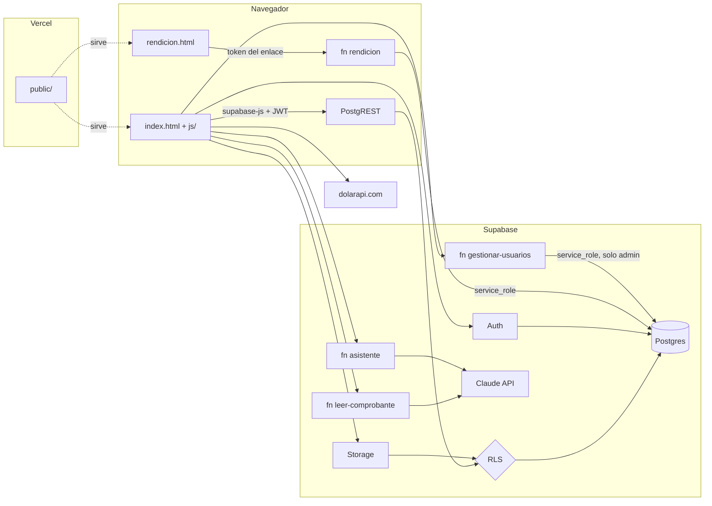

# 02 · Arquitectura y tecnologías

## Tecnologías

| Capa | Tecnología | Notas |
|---|---|---|
| Frontend | HTML, CSS y JavaScript sin framework ni build | `public/js/` en scripts clásicos (núcleo, vistas, formularios) que comparten el ámbito global; dibujan con template strings. Mapa en `public/js/README.md` |
| Librerías | `@supabase/supabase-js` 2.117.3, `xlsx` 0.18.5 | Desde jsDelivr, con versión exacta y hash de integridad (SRI) |
| Hosting | Vercel | Publica `public/` desde `main`; un deploy de vista previa por pull request |
| Base de datos | Supabase Postgres 17 | Seguridad por filas (RLS) en todas las tablas |
| Autenticación | Supabase Auth | Email y contraseña; sin registro público |
| Archivos | Supabase Storage | Tres depósitos privados; se accede con URLs firmadas que vencen |
| Lógica de servidor | Supabase Edge Functions (Deno) | Lo que necesita claves secretas o servicios externos |
| Lectura de comprobantes | ZXing (QR), pdf.js (texto de PDF), Tesseract (OCR) | Corren en el navegador; servidas desde `public/vendor/` con versión fija (`npm run vendor`) y cargadas solo al usarlas |
| IA | API de Anthropic (Claude) | Último paso de la lectura de comprobantes, y redacción; la clave vive solo en Supabase |
| Cotización | dolarapi.com | Dólar oficial; se puede cargar a mano |

## Diagrama



## Cómo viajan los datos

1. El usuario inicia sesión con email y contraseña. Supabase Auth devuelve un
   JWT que `supabase-js` guarda en el navegador y renueva solo.
2. Al entrar, `cargarDatos()` trae todas las tablas que el usuario puede ver,
   por páginas de 1000 filas. **El RLS decide qué filas recibe cada uno**: el
   frontend no filtra por seguridad.
3. Los cálculos (totales, honorarios, participación, saldos) se hacen en el
   navegador sobre esos datos.
4. Cada alta, cambio o baja va directo a la tabla por la API. La base:
   - valida el permiso con RLS;
   - aplica los disparadores (cierre de período, caja de la misma obra, autoría);
   - registra el cambio en `auditoria`.
5. Después de guardar se recargan los datos.
6. Lo que necesita privilegios o claves secretas pasa por una Edge Function:
   gestión de usuarios, lectura con IA y rendición pública.

## Entornos

| Entorno | Supabase | Frontend | Datos |
|---|---|---|---|
| Producción (cliente Simple STGO) | `gccbybrslcrecimfblwe` | https://stgo.metroclaro.com.ar | Reales |
| Staging | `tverjzxsmwnrnpnsimgh` | https://staging.metroclaro.com.ar, `npm run dev` en local y las vistas previas de cada PR | Ficticios (`supabase/seed.sql`) |

Staging tiene **exactamente** el mismo esquema que producción: las mismas
migraciones, en el mismo orden.

## Un Vercel para todos, un Supabase por cliente

Cada cliente tiene su propio proyecto de Supabase (su base, sus usuarios,
sus archivos) y entra por su subdominio de `metroclaro.com.ar`. Un único
proyecto de Vercel publica el mismo código para todos: según el dominio,
`vercel.json` entrega el `config.js` de cada cliente
(`public/clientes/<id>.js`, generado desde `clientes.json`). Fuera de
producción la app muestra una franja de aviso. Ver
[Decisiones](decisiones.md) y [07 · Despliegue](07-despliegue.md).

## Estructura del repositorio

```
public/               Lo único que se publica
  index.html          Aplicación
  rendicion.html      Portal del inversor por enlace
  clientes/           config.js de cada cliente (generados desde clientes.json)
  js/nucleo/          Estado, datos, cálculos, render, escritura, arranque
  js/vistas/          Una o más pestañas por archivo
  js/formularios/     Ventanas de alta y edición
  css/ img/
  manifest.json sw.js PWA (el service worker no cachea nada)
supabase/
  migrations/         Esquema versionado: única fuente de verdad
  functions/          Edge Functions
  seed.sql            Datos ficticios para staging
scripts/              Servidor local, respaldo.bat, verificador de respaldos
tests/seguridad/      Sondeo sin login, pruebas de RLS e integridad
docs/                 Esta documentación
```
