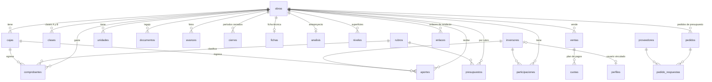

# 03 · Modelo de datos y cálculos

El esquema completo está en `supabase/migrations/`. Este documento explica
qué representa cada tabla y cómo se calcula cada número de la aplicación.

## Tablas

| Tabla | Qué guarda |
|---|---|
| `perfiles` | Un registro por usuario de Auth: nombre y rol (`admin`, `carga`, `inversor`) |
| `obras` | Obra, con los porcentajes de honorarios de conducción, administración y desarrolladora |
| `cajas` | Dónde está la plata (efectivo, mutual, banco), por obra |
| `clases` | Clases de participación A y B por obra, con su coeficiente |
| `rubros` | Catálogo compartido de rubros; `base_honorarios` indica si suma a la base de honorarios |
| `presupuestos` | Presupuesto en USD por obra y rubro |
| `inversores` | Ficha de la persona (nombre, CUIT, email); `perfil_id` la vincula a un usuario |
| `participaciones` | Qué inversor participa en qué obra y con cuánto suscripto (`comp_a`, `comp_b`) |
| `aportes` | Dinero que integra un inversor, con clase, caja, moneda y cotización |
| `comprobantes` | Gastos: proveedor, rubro, caja, importe, IVA, estado de pago |
| `ventas` | Facturas de venta de unidades; contado o en cuotas (USD o ajustadas por CAC) |
| `cuotas` | Plan de pagos de una venta; al cobrarse queda fijo el importe cobrado |
| `indices` | Índice CAC mensual (nivel o variación) |
| `unidades` | Departamentos, cocheras y locales, con superficie, coeficiente y estado |
| `fichas`, `analisis`, `niveles` | Ficha técnica, anteproyecto y superficies por nivel |
| `documentos` | Legajo; con `inversor_id` es reservado para ese inversor |
| `avances` | Fotos y porcentaje de avance físico |
| `proveedores`, `pedidos`, `pedido_respuestas` | Catálogo de proveedores y pedidos de presupuesto |
| `enlaces` | Enlaces de rendición: token, inversor, obra, vencimiento, visitas |
| `cierres` | Fecha hasta la que una obra está cerrada |
| `auditoria` | Historial de altas, cambios y bajas. Lo escribe solo la base |

**Vistas `v_*`:** existen en la base pero **la aplicación no las usa**: todos
los cálculos se hacen en el navegador. Son `security_invoker` y no están
expuestas a la API (ver [Seguridad](04-seguridad.md)).

## Dinero y monedas

- Cada movimiento guarda `moneda` (`ARS` o `USD`), `importe` y `cotizacion`.
- La columna `usd` es **calculada por la base** y no se puede editar:
  `usd = importe` si es en dólares, `importe / cotizacion` si es en pesos.
  Así el valor en dólares queda fijo con la cotización del día del movimiento.
- Todos los totales de la aplicación son en dólares, sobre la columna `usd`.
- Los montos usan `numeric(14,2)` y las cotizaciones `numeric(14,4)`.

## Cálculos principales

Todos están en `public/js/nucleo/calculos.js`, salvo el calculador de
aportes, que está en `public/js/vistas/inversores.js`.

Un comprobante **computa** si `afecta_caja = true`. Los que no afectan caja
son solo informativos para el contador: no suman al costo ni generan deuda.

| Número | Cómo se calcula | Función |
|---|---|---|
| Aportes de la obra | Suma de `usd` de los aportes | `totalesObra` |
| Ejecutado | Suma de `usd` de los comprobantes que computan | `totalesObra` |
| Pagado / Deuda | Ejecutado separado por `pago = pagado / pendiente` | `totalesObra` |
| Saldo de caja (obra) | Aportes − pagado | `totalesObra` |
| Disponible neto | Aportes − pagado − deuda | `totalesObra` |
| Avance financiero | Ejecutado / presupuesto total | `totalesObra` |
| Saldo de una caja | Aportes a esa caja − comprobantes pagados desde esa caja | `saldoCaja` |
| Base de honorarios ejecutada | Comprobantes que computan, de rubros con `base_honorarios` y con `computa_honorarios` | `baseEjecutada` |
| Honorario devengado | Base ejecutada × porcentaje de la obra | `honorarios` |
| Honorario proyectado | Presupuesto de los rubros base × porcentaje | `honorarios` |
| Saldo de honorarios | Devengado − lo ya pagado en el rubro de ese honorario | `honorarios` |
| Unidades de participación de un aporte | `usd` × coeficiente de su clase (A o B) | `unidades` |
| Participación de un inversor | Sus unidades / unidades de todos en la obra | Inversores, Rendición |
| Aporte a requerir | Prorrateo por participación o por capital suscripto, descontando lo integrado | `calculadorAportes` |
| Importe de una cuota CAC | `monto_base × último CAC / CAC del período base`; si está cobrada, el importe cobrado | `montoCuota` |
| Serie CAC | Si un mes tiene variación pero no nivel, el nivel se encadena desde el mes anterior | `serieCac` |
| Costo del anteproyecto | Superficie por tipo × costo base × coeficiente del tipo, más terreno, comisión, honorarios y gastos | `computo` |

> Si se cambia una fórmula, hay que cambiarla también en `rendicion.html`
> (participación) y documentarlo acá.

## Reglas que hace cumplir la base

| Regla | Mecanismo |
|---|---|
| Quién ve y edita qué | Políticas RLS por rol y por obra (`obra_visible`, `puede_editar`, `es_admin`) |
| No se tocan movimientos de un período cerrado (aportes, comprobantes, ventas, cobros de cuotas) | Disparadores `proteger` |
| La caja de un movimiento es de su misma obra | Disparador `validar_caja` |
| La autoría (`creado_por`, etc.) es el usuario de la sesión | Disparador `fijar_autor` |
| Siempre queda al menos un administrador | Disparador `mantener_un_admin` |
| Todo cambio queda en el historial | Disparador `auditar` → `registrar_cambio` |
| El plan de cuotas se crea completo o no se crea | Función `generar_plan_cuotas` (una transacción) |
| Importes positivos, monedas y estados válidos | Restricciones `check` |
