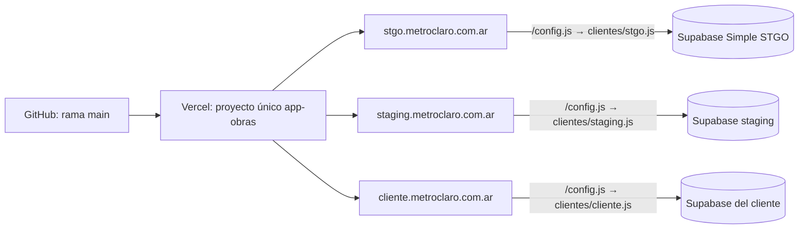

# 07 · Despliegue y clientes

## Modelo: un Vercel, un Supabase por cliente



- **Un solo proyecto de Vercel** (`app-obras`) publica el código para todos
  los clientes. Cada cliente entra por **su subdominio de
  `metroclaro.com.ar`** (por ejemplo `mympropiedades.metroclaro.com.ar`).
- **Un proyecto de Supabase por cliente**: base, usuarios y archivos
  separados (ver [Decisiones](decisiones.md)).
- La app pide `/config.js`. Ese archivo no existe como tal: `vercel.json`
  tiene una regla por dominio que entrega el de cada cliente
  (`public/clientes/<id>.js`). Un dominio desconocido o una vista previa de
  un pull request recibe **staging**, nunca un cliente real.
- Un merge a `main` publica **para todos los clientes a la vez**. Por eso todo
  pasa antes por staging, y las migraciones se aplican en **todas** las bases
  antes de mergear (ver [06 · Base de datos](06-base-de-datos.md)).

### Costos

| Concepto | ¿Crece por cliente? |
|---|---|
| Vercel | No: un solo proyecto |
| Dominios | No: subdominios de `metroclaro.com.ar` |
| Supabase | **Sí**: un proyecto por cliente (con plan Pro, ~USD 10/mes por proyecto adicional) |

## El registro de clientes: `clientes.json`

En la raíz del repo (no se publica). Solo valores **públicos**:

```json
{
  "porDefecto": "staging",
  "clientes": [
    {
      "id": "stgo",
      "nombre": "Simple STGO",
      "entorno": "produccion",
      "dominios": ["stgo.metroclaro.com.ar"],
      "supabaseUrl": "https://gccbybrslcrecimfblwe.supabase.co",
      "supabaseKey": "sb_publishable_..."
    }
  ]
}
```

| Campo | Notas |
|---|---|
| `id` | Minúsculas, números y guiones. Nombra el archivo `public/clientes/<id>.js` |
| `nombre` | Se muestra en la pantalla de acceso |
| `entorno` | `produccion` o `staging`. En `staging` la app muestra una franja de aviso |
| `dominios` | Subdominios de `metroclaro.com.ar` (se admiten también `*.vercel.app`) |
| `supabaseUrl` / `supabaseKey` | URL y **publishable** key del proyecto de Supabase del cliente. Nunca la secret ni la service_role |
| `porDefecto` | Cliente para dominios desconocidos y vistas previas. **Tiene que ser de staging** |

Después de editarlo:

```bash
npm run clientes
```

Valida el archivo (rechaza claves secretas, dominios repetidos o fuera de
`metroclaro.com.ar`, un `porDefecto` de producción) y regenera
`public/clientes/*.js` y las reglas (`rewrites`) de `vercel.json`. Los tres
se commitean juntos. La CI falla si quedaron desincronizados.

## Configuración del proyecto de Vercel

*Settings → Build and Deployment*: todo en automático. `vercel.json` define:

| Qué | Valor |
|---|---|
| Install | No instala nada: publicar no necesita dependencias |
| Build | Ninguno |
| Output | `public` |
| Rewrites | Una regla de `/config.js` por dominio + la regla por defecto (generadas) |
| Headers | `X-Frame-Options`, `nosniff`, `Referrer-Policy`, `Permissions-Policy` |

*Settings → Git*: **Production Branch** = `main`. **Root Directory** vacío.
*Settings → Domains*: un dominio por cliente (más `staging.metroclaro.com.ar`).

**Nunca** publicar a mano la carpeta del proyecto entera.

## Edge Functions y secretos

Se despliegan en **cada** proyecto de Supabase (ver
[06 · Base de datos](06-base-de-datos.md)). Secretos en cada proyecto
(*Edge Functions → Secrets*):

| Secreto | Para qué |
|---|---|
| `ANTHROPIC_API_KEY` | `leer-comprobante` y `asistente` |
| `SUPABASE_URL`, `SUPABASE_ANON_KEY`, `SUPABASE_SERVICE_ROLE_KEY` | Los inyecta Supabase solo |

Conviene una clave de Anthropic por cliente, con **límite de gasto**.

## Configuración de Auth (cada proyecto de Supabase)

En *Authentication → Sign In / Providers*: **Allow new users to sign up**
desactivado y **Confirm email** activado.

En *Authentication → URL Configuration*: **Site URL** =
`https://<subdominio del cliente>.metroclaro.com.ar`, para que los mails de
invitación y recuperación vuelvan a su app.

## Alta de un cliente nuevo

Ejemplo: MYM Propiedades → `mympropiedades.metroclaro.com.ar`.

> Con el plan gratuito de Supabase solo entran 2 proyectos (Simple STGO y
> staging). Para un cliente real hace falta plan Pro. El procedimiento se
> ensaya con staging como si fuera un cliente.

1. **Supabase:** *New project* en la organización "Obras", región
   `sa-east-1`. Guardar la contraseña de la base en un gestor de contraseñas.
2. **Esquema:** aplicar todas las migraciones de `supabase/migrations/` en orden.
3. **Datos iniciales:** los rubros del estudio. **No** correr `seed.sql`.
4. **Edge Functions:** desplegar las cuatro (`rendicion` sin verificación de
   JWT) y cargar `ANTHROPIC_API_KEY`.
5. **Auth:** registro cerrado, confirmación de email, Site URL.
6. **Primer administrador:** *Authentication → Users → Add user*, y en el SQL Editor:
   ```sql
   update public.perfiles set rol = 'admin', nombre = 'Nombre'
   where id = (select id from auth.users where email = 'cliente@...');
   ```
7. **Registro:** en una rama nueva, agregar el cliente a `clientes.json`,
   `npm run clientes`, pull request y merge.
8. **Dominio:** en Vercel, proyecto `app-obras` → *Settings → Domains* →
   agregar `mympropiedades.metroclaro.com.ar`. En el DNS de
   `metroclaro.com.ar`, el registro que indique Vercel (normalmente un
   `CNAME` a `cname.vercel-dns.com`).
9. **Verificar:**
   - `tests/seguridad/huella-esquema.sql` igual al de Simple STGO;
   - `npm run test:seguridad` con `SUPABASE_URL` y `SUPABASE_KEY` del cliente: **SIN FALLAS**;
   - `https://mympropiedades.metroclaro.com.ar/config.js` devuelve **su** URL de Supabase;
   - la pantalla de acceso muestra su nombre y no tiene franja de staging;
   - entrar con su admin: la base está vacía (o con sus datos).

## Desarrollo local

`npm run dev` usa `.env.local` (staging por defecto). Sin `.env.local`, el
servidor local entrega el cliente `porDefecto` de `clientes.json`, igual que
Vercel con un dominio desconocido.
